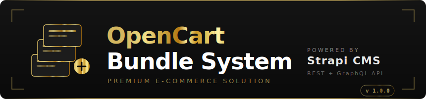

<div align="center">



<br><br>

[](https://opencart.com)
[](https://php.net)
[](https://strapi.io)
[](https://nodejs.org)
[](https://mysql.com)
[](LICENSE)

**A premium product bundle system for OpenCart 3.x, powered by a Strapi v5 headless CMS.**  
Create fixed, dynamic, tiered, and mix-and-match bundles — managed centrally and delivered via REST + GraphQL.

[Branch Guide](#-branch-guide) · [Architecture](#-architecture) · [Deployment](#-plesk-git-deployment) · [API Reference](#-api-reference) · [Troubleshooting](#-troubleshooting)

</div>

---

## 🌿 Branch Guide

This repository has **three branches**, each purpose-built for a different hosting scenario:

| Branch | What it deploys | Deploy script | Use case |
|--------|----------------|--------------|----------|
| [`main`](../../tree/main) | **OpenCart Bundle Module only** | `.plesk/post-deploy-opencart` | You already have Strapi on a separate server/domain |
| [`strapi-api`](../../tree/strapi-api) | **Strapi CMS API only** | `.plesk/post-deploy-strapi` | Strapi runs on its own subdomain (`oc-api.yourdomain.com`) |
| [`bundled`](../../tree/bundled) | **OpenCart + Strapi together** | `.plesk/post-deploy-bundled` | Both run on one domain (Strapi proxied under `/api`) |

---

## 📐 Architecture

### Option A — Separated (2 domains, recommended for production)
```
  Branch: main                    Branch: strapi-api
  oc.yourdomain.com               oc-api.yourdomain.com
  ┌──────────────────┐            ┌──────────────────────┐
  │  OpenCart Store  │ ─── REST ──│  Strapi CMS API      │
  │  + Bundle Module │            │  Port 1337           │
  └──────────────────┘            └──────────────────────┘
```

### Option B — Bundled (1 domain, great for dev / small installs)
```
  Branch: bundled
  yourdomain.com
  ┌─────────────────────────────────────────────────┐
  │  httpdocs/              → OpenCart store        │
  │  httpdocs/strapi/       → Strapi app files      │
  │  yourdomain.com/strapi  → Strapi admin (proxy)  │
  │  yourdomain.com/api     → REST API   (proxy)    │
  │  yourdomain.com/graphql → GraphQL    (proxy)    │
  └─────────────────────────────────────────────────┘
```

---

## 🚀 Plesk Git Deployment

> **Before you start:** The `httpdocs/` directory for each domain must be **completely empty** (no files, no `.git` folder). Delete everything including hidden files before adding the Git repo in Plesk.

---

### Deploy Option A — OpenCart Module (`main` branch)

In Plesk → **Websites & Domains** → `oc.yourdomain.com` → **Git** → **Add Repository**:

| Field | Value |
|-------|-------|
| Repository URL | `https://github.com/MavenMusicLLC/OpenCart3-StrapiCMSAPI.git` |
| Branch | `main` |
| Deploy path | `/var/www/vhosts/oc.yourdomain.com/httpdocs/` |
| Deployment action | `bash .plesk/post-deploy-opencart` |

**What the script does:**
- Copies `opencart-module/` files into `catalog/` and `admin/`
- Runs database migration (`install/migrate.php` or `bundle_install.sql`)
- Adds `STRAPI_API_URL` to `config.php`
- Clears OpenCart modification cache
- Fixes Plesk `user:psacln` ownership and permissions

---

### Deploy Option A — Strapi API (`strapi-api` branch)

In Plesk → **Websites & Domains** → `oc-api.yourdomain.com` → **Git** → **Add Repository**:

| Field | Value |
|-------|-------|
| Repository URL | `https://github.com/MavenMusicLLC/OpenCart3-StrapiCMSAPI.git` |
| Branch | `strapi-api` |
| Deploy path | `/var/www/vhosts/oc-api.yourdomain.com/httpdocs/` |
| Deployment action | `bash .plesk/post-deploy-strapi` |

**What the script does:**
- Verifies Node.js 18+
- Runs `npm ci` to install dependencies
- Creates `.env` from `.env.example` with **auto-generated secure secrets**
- Runs `npm run build` to compile the Strapi admin panel
- Writes `.htaccess` Apache proxy rules
- Starts Strapi via PM2 (`strapi-oc-api`)
- Fixes Plesk file ownership and permissions

After deploy, edit the database credentials:
```bash
nano /var/www/vhosts/oc-api.yourdomain.com/httpdocs/.env
pm2 restart strapi-oc-api
```

---

### Deploy Option B — Bundled (`bundled` branch)

In Plesk → **Websites & Domains** → `yourdomain.com` → **Git** → **Add Repository**:

| Field | Value |
|-------|-------|
| Repository URL | `https://github.com/MavenMusicLLC/OpenCart3-StrapiCMSAPI.git` |
| Branch | `bundled` |
| Deploy path | `/var/www/vhosts/yourdomain.com/httpdocs/` |
| Deployment action | `bash .plesk/post-deploy-bundled` |

**What the script does:**
- Deploys OpenCart Bundle Module (same as `main`)
- Moves Strapi source into `httpdocs/strapi/`
- Installs Node.js dependencies inside `strapi/`
- Creates `strapi/.env` with auto-generated secrets
- Builds the Strapi admin panel
- Writes `.htaccess` to proxy `/api`, `/graphql`, `/strapi` → port 1337
- Starts Strapi via PM2 (`strapi-bundled`)
- Fixes all permissions

After deploy, edit the database credentials:
```bash
nano /var/www/vhosts/yourdomain.com/httpdocs/strapi/.env
pm2 restart strapi-bundled
```

Access points after bundled deploy:
```
https://yourdomain.com/          ← OpenCart storefront
https://yourdomain.com/strapi    ← Strapi admin panel
https://yourdomain.com/api       ← REST API
https://yourdomain.com/graphql   ← GraphQL
```

---

## 🔧 First-Time Strapi Setup (both options)

1. Visit your Strapi admin URL and create the first admin account
2. Seed demo data:
   ```bash
   curl -X POST https://your-api-url/api/seed
   ```
3. In OpenCart Admin → **Extensions** → **Extensions** → **Modules** → **Bundle Manager** → **Install** → **Edit**
4. Set **API URL** to your Strapi `/api` URL and set **Status** → **Enabled**
5. Go to **Design** → **Layouts** → **Product** → add **Bundle Product** to Content Bottom

---

## 📦 Bundle Types

| Type | How It Works | Example |
|------|-------------|---------|
| **Fixed** | Pre-set group sold together at a discount | Gaming PC: CPU + GPU + RAM + SSD |
| **Dynamic** | Customer picks from an approved pool | Build Your Own Studio Kit |
| **Tiered** | Discount grows with quantity | Buy 2 = 10% off · Buy 3 = 20% off |
| **Mix & Match** | Any combination up to X items for a flat price | Any 3 accessories for $50 |

---

## 🔌 API Reference

Base URL: your Strapi domain or `yourdomain.com/api` (bundled)

### Bundles

| Method | Endpoint | Description |
|--------|----------|-------------|
| `GET` | `/api/bundles` | List all bundles (filters, pagination) |
| `GET` | `/api/bundles/:id` | Get bundle by Strapi ID |
| `GET` | `/api/bundles/slug/:slug` | Find bundle by URL slug |
| `GET` | `/api/bundles/by-product/:productId` | All bundles containing a product |
| `GET` | `/api/bundles/:id/calculate` | Calculate savings |
| `POST` | `/api/bundles/sync` | Bulk sync from OpenCart |

### Products & Categories

| Method | Endpoint | Description |
|--------|----------|-------------|
| `GET` | `/api/products` | List all products |
| `GET` | `/api/products/by-oc-id/:id` | Find by OpenCart product_id |
| `POST` | `/api/products/sync` | Bulk sync from OpenCart |
| `GET` | `/api/categories` | List all categories |
| `POST` | `/api/categories/sync` | Bulk sync from OpenCart |

### System

| Method | Endpoint | Description |
|--------|----------|-------------|
| `GET` | `/api/status` | Health check |
| `GET` | `/api/stats` | Content statistics |
| `POST` | `/api/seed` | Seed demo data |
| `POST` | `/api/seed/reset` | Reset seeded data |

### GraphQL

```graphql
query {
  bundles(filters: { isActive: { eq: true } }) {
    documentId
    name
    slug
    bundlePrice
    discountPercent
    products
  }
}
```

---

## 📁 Repository Structure

```
main branch
├── opencart-module/
│   ├── admin/               # Admin controllers, models, views, language
│   └── catalog/             # Frontend controllers, models, views, language
├── assets/                  # SVG logos and branding
├── docs/TUTORIAL.md         # Full step-by-step tutorial
└── .plesk/
    └── post-deploy-opencart # ← runs on Plesk Git deploy (main)

strapi-api branch
├── src/api/                 # Bundle, category, product, seed content types
├── config/                  # database.js, server.js, plugins.js, middlewares.js
├── .env.example             # Environment template
├── package.json             # Strapi 5.x dependencies
└── .plesk/
    └── post-deploy-strapi   # ← runs on Plesk Git deploy (strapi-api)

bundled branch
├── opencart-module/         # OpenCart module (same as main)
├── src/api/                 # Strapi content types (same as strapi-api)
├── config/                  # Strapi config (same as strapi-api)
├── .env.example             # Strapi env template
├── package.json             # Strapi dependencies
└── .plesk/
    └── post-deploy-bundled  # ← runs on Plesk Git deploy (bundled)
                             #   deploys BOTH parts, creates strapi/ subdir
```

---

## 🛠️ Troubleshooting

| Problem | Cause | Fix |
|---------|-------|-----|
| `Deployment path already exists and is not empty` | Old files or `.git` in `httpdocs/` | Delete all files including hidden `.git` folder, then re-deploy |
| Module not in Extensions list | Cache not cleared | `rm -rf system/storage/modification/*` → Extensions → Modifications → Refresh |
| `Table 'oc_bundles' not found` | Migration didn't run | `php install/migrate.php` or run `bundle_install.sql` in phpMyAdmin |
| Strapi won't start | Missing `.env` or wrong DB creds | Edit `.env`, verify DB details, run `npm start` manually |
| Strapi admin unreachable | Apache proxy not active | Verify `.htaccess` proxy rules exist; `curl http://127.0.0.1:1337` on server |
| Bundles not on product page | Module not assigned to layout | Design → Layouts → Product → add Bundle Product to Content Bottom |
| `Permission denied` errors | Wrong Plesk file ownership | `chown -R user:psacln /var/www/vhosts/yourdomain.com/httpdocs/catalog/` |

### Useful Commands

```bash
# Check Strapi is running
curl http://127.0.0.1:1337/api/status

# Tail deploy log
tail -f /tmp/plesk-opencart-deploy.log
tail -f /tmp/plesk-strapi-deploy.log
tail -f /tmp/plesk-bundled-deploy.log

# Restart Strapi (Option A)
pm2 restart strapi-oc-api

# Restart Strapi (Option B bundled)
pm2 restart strapi-bundled

# Check OpenCart error log
tail -f system/storage/logs/error.log

# Re-run deploy scripts manually
bash .plesk/post-deploy-opencart
bash .plesk/post-deploy-strapi
bash .plesk/post-deploy-bundled
```

---

## 📚 Documentation

| Guide | Description |
|-------|-------------|
| [docs/TUTORIAL.md](docs/TUTORIAL.md) | Complete end-to-end tutorial with examples |

---

<br>

<div align="right">
  
</div>

## 🔐 Default Admin Credentials

After deployment, the OpenCart admin is automatically created:

| Username | Password |
|----------|----------|
| `admin` | `Geau@3x$` |

**URL:** `https://yourdomain.com/admin`

To change credentials after first login: Admin → Users → Administrators

